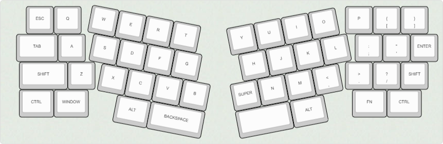
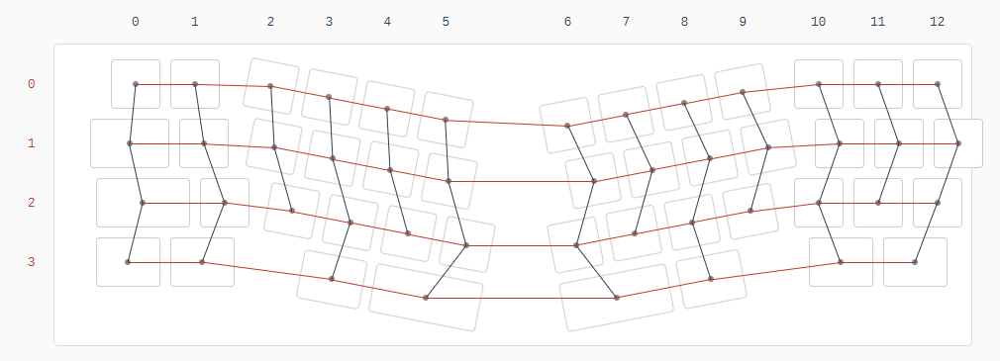
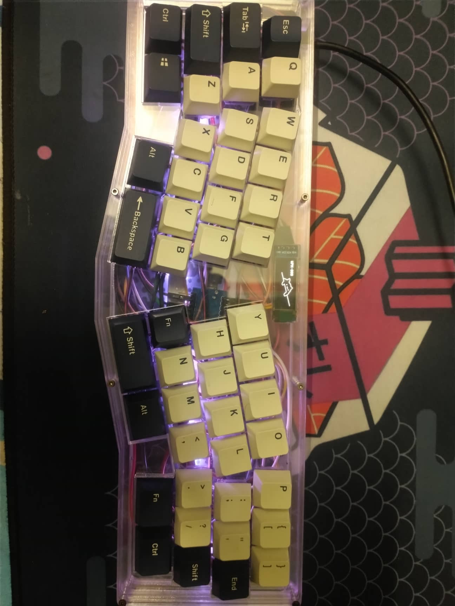

# TrongDong40
This is a 40% layout, Alice clone keyboard I designed. This was designed for my future hand-wired project.

[Keyboard Layout Editor](http://www.keyboard-layout-editor.com/#/gists/bd69171a64c51fef56333ebecacd0618)([raw data](/trongdong40.json))
# Pic
## Raw design

## Wiring 

## Front

# ToDo
- Acrylic sandwich case(I lost it :()
- PCB
- 3D printable case 
